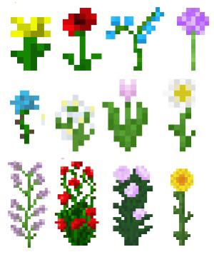

_Alison Dutton, Thomas charchie, Lily hiduke group_

**EE 322 Class**

---
# Views of Github
~~I'm scared to learn Github! This is my first time using it~~

**Like I am _super scared_ to learn. There's a lot of things to go over**

Shhh! don't tell anyone though!

`the views and opinions of Sabrina Elgazzar does not reflect on her group members`
---
## Sabrina Elgazzar Achievements
> During her time at Stevens, Sabrina Elgazzar has accomplished many things
1. Being a leader on campus
2. Having 3 internship oppertunities
3. Eating really good bagels

Through Sabrina's achievements, she has one thing to thank. The reason she has achieved these amazing things is because she stays organized. This is through google calender. Make your own using this link [Google Calender Link](https://calendar.google.com/calendar/u/0/r?pli=1) . #not sponsored

---
### Minecraft
There are numerous things you can accomplished in minecraft. The best thing about minecraft is that it is a free range gaming experience. You can do numerous things in no specific order.
- pick flowers
- build a house
- decorate the interior
- defeat the warden
- go mining

---

